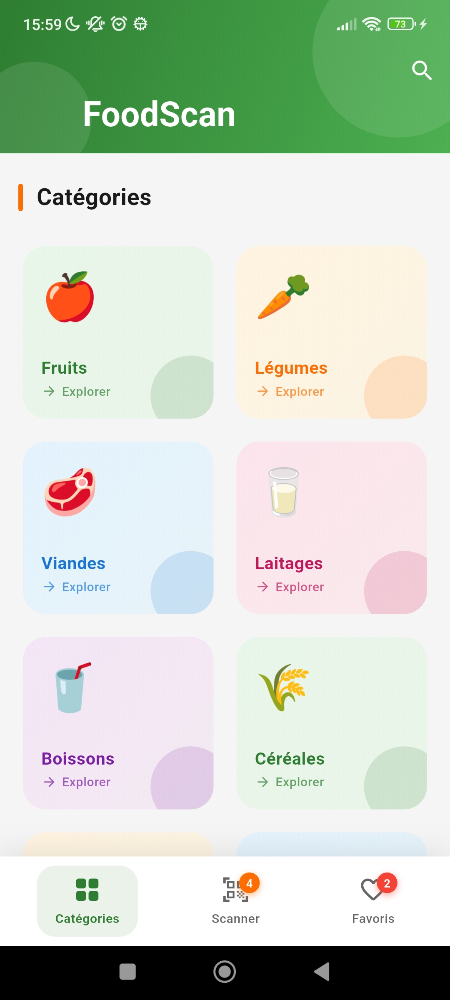
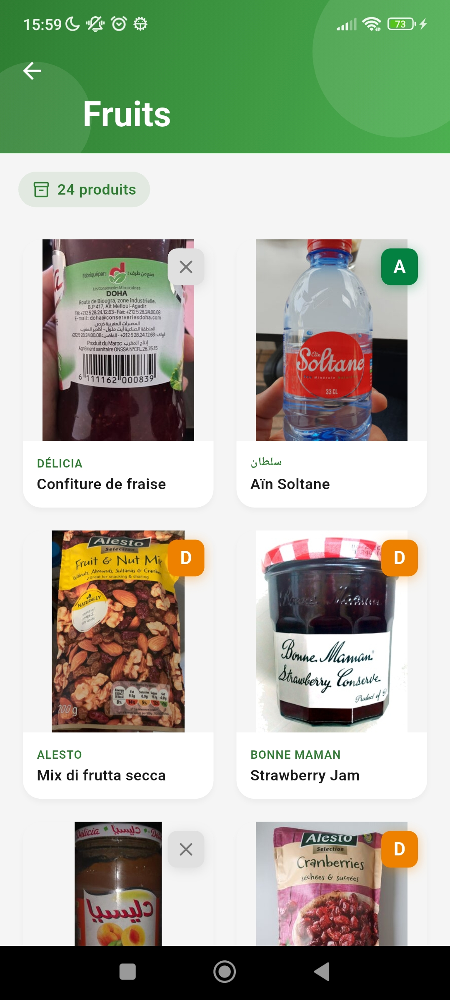
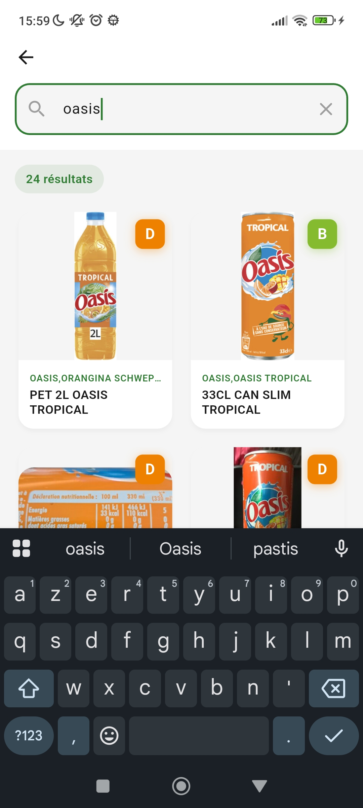
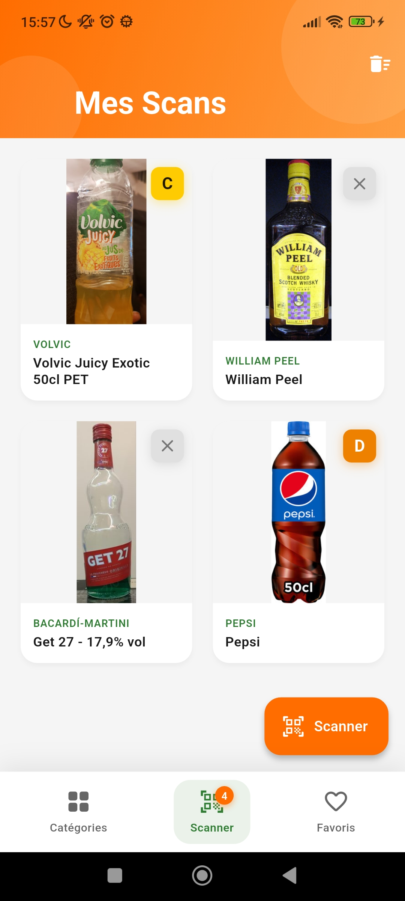
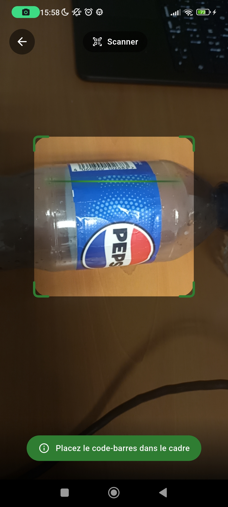
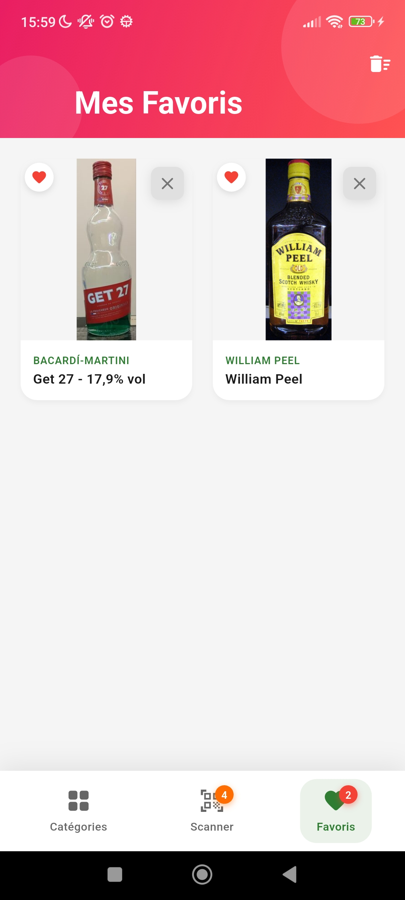
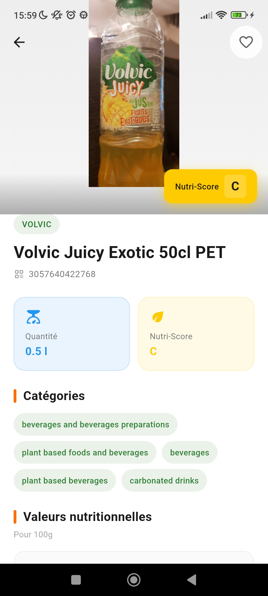
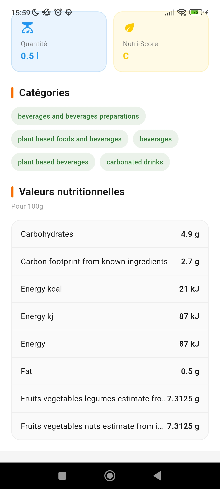

# Nom du Projet

## 👥 Équipe

- François-Pierre LAJUDIE
- Cyriaque LEMESLE

## 📱 Description

FoodScan est une application mobile Flutter permettant de scanner et rechercher des produits alimentaires pour consulter leurs informations nutritionnelles. L'application utilise l'API OpenFoodFacts pour récupérer les données des produits (Nutri-Score, valeurs nutritionnelles, ingrédients, etc.). Les utilisateurs peuvent parcourir les produits par catégories, scanner des codes-barres, effectuer des recherches et sauvegarder leurs produits favoris.

## 🎯 Orientation choisie

Équilibrée

## ✅ Contraintes respectées

Critères fonctionnels:

- Un aspect métier fort avec logique complexe (calculs, algorithmes, workflows)
- Utilisation de stockage persistant (local avec SharedPreferences/Hive/SQLite ou Firebase/Supabase)
- Intégration d'au moins un package de pub.dev (hors stockage) pertinent pour votre métier
- Consommation d'une API (publique, créée par vous, ou utilisation de Firebase/Supabase)

Critères de design

- Utilisation d'images (assets locaux ou réseau) de manière cohérente
- Intégration d'animations (Hero, AnimatedContainer, Lottie, etc.)

## 🚀 Installation

### Prérequis

- [Flutter](https://flutter.dev/docs/get-started/install) (SDK 3.10.7 ou supérieur)
- Un émulateur Android / iOS ou un appareil physique connecté

### 1. Cloner le dépôt

```bash
git clone <url-du-repo>
cd eval
```

### 2. Récupérer les dépendances

```bash
flutter pub get
```

### 3. Lancer l’application

```bash
flutter run
```

Choisissez l’appareil ou l’émulateur cible si plusieurs sont disponibles.

### 4. (Optionnel) Générer un APK de release

Pour construire un APK à installer sur Android :

```bash
flutter build apk --release
```

L’APK est généré dans `build/app/outputs/flutter-apk/app-release.apk`.

### 5. APK

Un fichier APK est déposé dans le dépôt Git (dans le dossier `apk/`) pour pouvoir lancer et tester facilement l’application sur un appareil Android sans avoir à compiler le projet.

## 📸 Screenshots

Les captures d'écran suivantes présentent l'application dans un ordre de découverte logique.

### 1. Navigation principale
Barre de navigation avec les trois onglets : **Catégories**, **Scanner** et **Favoris**.



### 2. Catégories
Page d'accueil pour parcourir les produits par catégorie (Fruits, Légumes, Viandes, etc.).



### 3. Recherche
Recherche de produits par nom pour trouver rapidement un aliment.



### 4. Mes produits scannés
Liste des produits ajoutés via le scan de code-barres.



### 5. Scanner
Interface de scan pour lire le code-barres d'un produit.



### 6. Favoris
Produits mis en favoris pour un accès rapide.



### 7. Détail d'un produit
Fiche produit avec Nutri-Score, valeurs nutritionnelles et informations détaillées.

| Fiche produit (exemple 1) | Fiche produit (exemple 2) |
|---------------------------|---------------------------|
|  |  |


## 📸 Vidéo de présentation


## 📝 Difficultés rencontrées

[2-3 défis techniques que vous avez surmontés]

- optimiser le chargement des informations de l'api
- implémenter le scanner de produits
